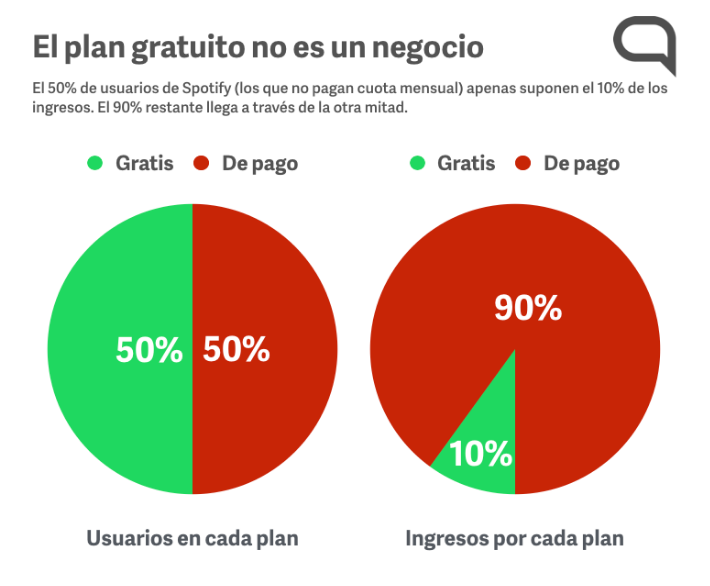
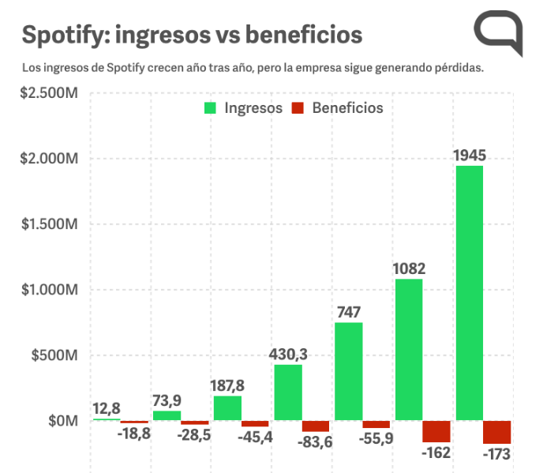

# KidOn 
by Spotify

## Hipótesis

A través de un producto para niños menores de 8 años, enfocado a adultos con hij@s o que conviva con niñ@s pequeñ@s, lograríamos aumentar en 10% el número de suscriptores Premium para Spotify en los próximos 6 meses.

## Un gran problema

A pesar de su reciente entrada a la Bolsa de Valores, hay una creciente especulación con respecto a la cada vez menor rentabilidad del modelo de negocio de Spotify tal como lo conocemos hasta hoy. Aunque Spotify aumenta su número de usuari@s de manera constante, esto no significa que cada un@ de esos usuari@s aporte los 9,99 dólares mensuales en promedio, que es el costo de la versión premium, al contrario, como se puede ver en la siguiente gráfica sólo la mitad están suscritos a la versión de paga. Y aún entre los usuari@s Premium hay que considerar las promociones y paquetes familiares que les permiten pagar menos de los 9,99 dólares.

Aunado a lo anterior, la economía de la compañía se enfrenta a otros retos:

* La tasa de bajas de suscriptores ha caído del 7% al 5% en los últimos años
Spotify no se puede permitir un caída constante en el número de suscriptores, pues como ya vimos, de ellos dependen prácticamente todos sus ingresos.
* Gastos por pago de licencias
Spotify busca constantemente renegociar el costo de las diferentes licencias, pero es una realidad que ni a artistas (como Taylor Swift, por ejemplo) ni a empresas discográficas les agrada la idea de que existan usuarios que no paguen por su contenido, de modo que hay contenido disponible sólo para usuarios Premium. Aún así Spotify se ha esmerado en mantener la versión gratuita.
* Gastos en marketing, ventas, investigación, desarrollo, administración, etc.
Spotify hizo un incremento en estos rubros del 23% al 30% entre 2015 y 2017.
* Usuarios ilegales 
Se estima que aproximadamente 2 millones de usuarios estén usando la plataforma gratuita de Soptify de manera ilegal. Esto significa que estarían usando algún tipo de alteración en el código para evitar los anuncios. Spotify se ha dedicado a tomar medidas legales en contra de usuarios que lleven a cabo este tipo de acciones. 

Todo lo anterior se ha visto traducido en pérdidas operativas de más de 300 millones de euros en 2017

## El público infantil

El rango de edad de usuari@s de Spotify es muy amplio. Un porcentaje importante se encuentra en edad reproductiva y presumiblemente tiene o tendrá hij@s pequeñ@s.

Un producto enfocado a las madres y padres pero dirigido a l@s usuari@s más pequeñ@s nos ayudaría a:

* Diversificar
Actualmente Spotify tiene un producto con un modelo de negocio cuyos rendimientos producen recelo en la industria. Si generamos productos por segmentos, diversificamos la oferta y podemos buscar modelos innovadores que reporten mayores benficios tanto a usuarios, como clientes y, desde luego, a Spotify.
* Aumentar conversión
Creando un producto lo suficientemente atractivo, podríamos aumentar la adquisición de cuentas Premium entre los adultos con hij@s o al cuidado de niñ@s pequeñ@s.
* Captación de nuevas audiencias
Gnereamos futuros usuarios cuyos hábitos de consumo y preferencias podrán ser rastreados a lo largo del tiempo, lo cual representa una rica fuente de información para la creación de nuevos productos y generación de contenidos.  
* Aumento de ingresos por publicidad
Algunas empresas estarían dispuestas a pagar por la infomración recopilada de este segmento.

YouTube ha reconocido esta oportunidad creando su plataforma para niños YouTube Kids. La pregunta sería: ¿Spotify podría librar la batalla como competidor directo de YouTube Kids?

## KidOn vs YouTube Kids

### YouTube Kids

Aunque YouTube es una de las plataformas más exitosas de los últimos tiempos, se ha visto en una serie de polémicas con respecto al manejo del contenido infantil, lo cual no lo ha dejado muy bien parado entre las madres y padres de familia que usan la plataforma de videos como entretenimiento para sus hij@s.

* #ElsaGate
* Contenido inapropiado
* Anuncios comerciales
* Videos de publicidad encubierta
(Unboxing, juguetes, comida chatarra)

Aunque YouTube es una plataforma robusta y muy bien respaldada, y a pesar de intentar corregir los errores y tomar medidas como cambiar el algoritmo por personas que se dediquen a moderar manualmente este contenido, le será difícil recuperar del todo la credibilidad de los padres y madres de familia.

### KidOn

¿Qué es lo que puede ofrecer Spotify a madres y padres que no les da YouTube Kids?

* Seguridad
* Contenido verificado
* Sin anuncios 
* Sin publicidad encubierta

Todo esto lo podemos ofrecer desde Spotify por la sencilla razón de que todo el contenido es legal y respaldado directamente por sus creadores o las empresas que distribuyen el contenido de manera oficial. Ninguna persona no autorizada puede introducir contenido sin pasar por los canales de autorización de Spotify.

### Recursos

[Segmentacion TeensZ](https://www.forbes.com.mx/spotify-abre-espacio-en-su-plataforma-para-la-generacion-z/)
[Rentabilidad](https://hipertextual.com/2017/03/las-cifras-de-spotify)
[Rentabilidad 2](http://www.expansion.com/opinion/2018/03/04/5a9c244f46163f644e8b4657.html)
[Contenido propio](https://hipertextual.com/2017/09/spotify-deriva-creacion-contenido-propio)
[Usuarios youtube Kids](https://www.eleconomista.com.mx/tecnologia/YouTube-Kids-celebra-11-millones-de-pequenos-usuarios-semanales-20171102-0092.html)
[Condiciones Youtube Kids](https://www.internautas.org/html/9761.html)
[Contenido popular](https://www.lanacion.com.ar/2098824-quienes-estan-detras-de-los-canales-de-youtube-kids-mas-populares)
[Moviles niños mexicanos](http://www.economiahoy.mx/telecomunicacion-tecnologia-mx/noticias/6841551/07/15/Aumenta-uso-de-dispositivos-moviles-en-ninos-mexicanos-de-dos-anos.html)

